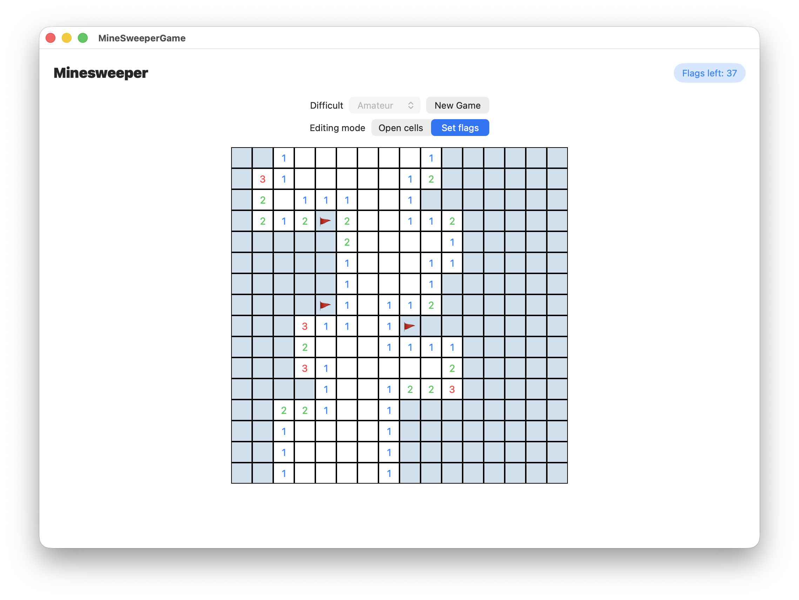
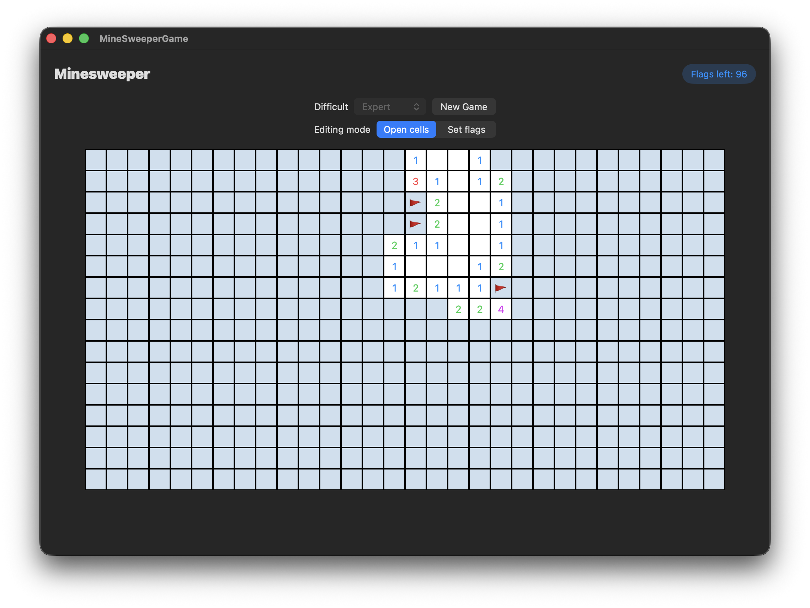

# MineSweeperGame

## Project Description

**MineSweeperGame** is a classic Minesweeper game built for **macOS** using **SwiftUI** and following the **MVVM architecture**.
The game has multiple difficulty levels and also supports both **Light** and **Dark** macOS themes, adapting its colors and UI elements.

## Screenshots

  
  
  
  

## Features

### Game Board
- Dynamic Grid: The board size adjusts based on the selected difficulty level.
- Mine Placement: Mines are randomly placed at the start of each game.
- Neighbor Count: Each cell displays the number of adjacent mines.
- Recursive Cell Opening: Opening a cell with no nearby mines automatically reveals neighboring cells.

### UI Components
- Header: Displays game title and mines left.
- Control Panel: Select difficulty and start a new game.
- Grid Cells: Each cell is a button showing its state (closed, open, flagged).

## Technologies
- SwiftUI: Used for building a modern, responsive macOS interface.
- Combine: Handles reactive state updates and game logic.
- MVVM Architecture: Separates game logic (ViewModel) from UI (View) and data (Model).
